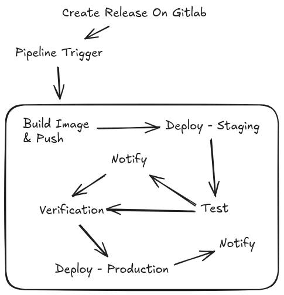

# Full System Exmaple

This is an example of an automated test and deploy process. The key items are the following:
- `Dockerfile` - Builds an example image
- `.gitlab-ci.yml` - Contains the CI processes
- `deploy.yml` - The Ansible deployment playbook. Used to deploy the module to setonix.
- `test.yml` - The Ansible test playbook. Used to test the module on setonix.
- `inventory.yml` - The Ansible inventory. Contains hostname(s) to run tasks on and variables attached to them.
- `modulefile.lua.jinja2` - The modulefile template. Ansible uses this to generate the module file

# CI Process
## Workflow

The CI process is triggered whenever a new tag is created (`- if: $CI_COMMIT_TAG`). It could instead be whenever a new release is made, or any other desirable condition. You could even have the completion of another CI pipeline trigger this one.

### Build
Build the Dockerfile and push to the registry. This requires the following CI variables set:
- DOCKER_HUB_USERNAME
- DOCKER_HUB_PASSWORD

This step is set up for DockerHub, but there is no reason it can't be another configured registry.

### Deploy - Staging
This uses an SSH key to authenticate on Setonix. For information on SSH key set up for Gitlab, see the [Docs](https://docs.gitlab.com/ci/jobs/ssh_keys/#create-and-use-an-ssh-key). The user needs to have the public key in their .ssh directory on Setonix. For the sake of example, I have used my personal user here. For production, this should be a privileged user. The user also needs to be set for each host in their respective host_vars file.

The command run in the CI file invokes the `ansible-playbook` command. This runs the `deploy.yml` file with ansible with the staging host as described in `inventory.yml`. Each of the tasks outlined in the file are run procedurally:
- Makes the module and software directories on Setonix if they do not exist
- Loads the singularity module and pulls the image from the registry
- Creates a Lua modulefile with the new tag version (via the template file)

### Test && Verify
The staged module is tested with the `test.yml` playbook. All this does is check that the expected module file and software files exist, then attempts to load and run them. However, there's no reason this can't be expanded upon.
Provided this does not produce any errors, the verify step is triggered. Ideally, this would product some sort of notification to the interested parties. Importantly, this requires manual approval before continuing. The pipeline can also be manually aborted at this stage.

### Deploy - Production
This step works much the same as the Staging deploy, but with different values for paths as described in the `inventory.yml` file.
